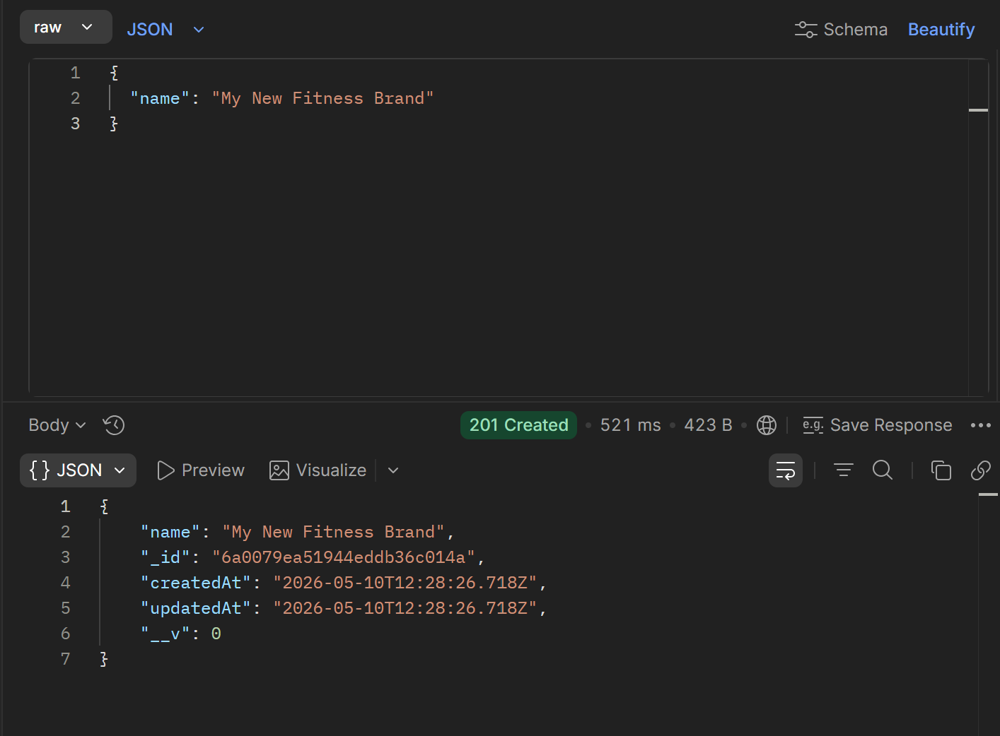
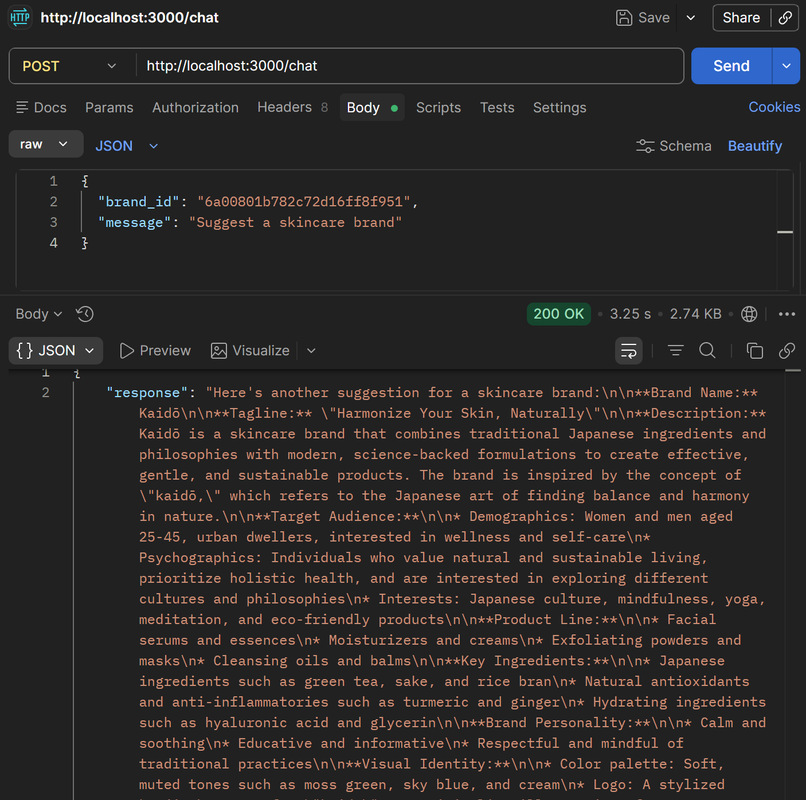
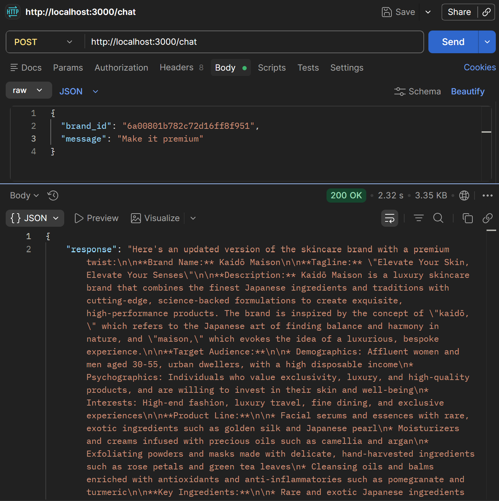

# AI Brand Assistant

## Project Overview
AI-powered backend service that allows users to create and manage multiple brands with isolated AI conversation context.

## Tech Stack
- Node.js
- Express.js
- MongoDB
- Groq API

## Features
- Multi-brand support
- Context-aware AI chat
- Persistent message history
- Context isolation per brand

## Setup Instructions

npm install
npm run dev

## Environment Variables

PORT=3000
MONGO_URI=your_mongodb_uri
GROQ_API_KEY=your_groq_key

## API Endpoints

POST /brands: Create a new brand. (Body: {"name": "Brand Name"})
GET /brands: List all created brands.
GET /brands/:id: Get details and context of a specific brand.
POST /chat: Send a message to the AI for a specific brand.

Request Body:

JSON
{
  "brand_id": "paste_your_brand_id_here",
  "message": "Make it more premium"
}

## Design Decisions
- MongoDB used for persistence
- Separate Message model for isolated context
- Full conversation history sent to LLM

## Limitations
- No authentication
- No streaming responses
- No summarization for long chats

## Future Improvements
- Redis caching
- Context summarization
- Frontend UI
- Vector DB memory

## 📸 API Screenshots

### 1. Create Brand Endpoint
This screenshot shows the successful creation of a new brand.

### 2. Initial Chat Interaction
First interaction with the AI where it suggests names and taglines based on the brand.

### 3. Contextual Follow-up (Context Management)
This shows the AI remembering previous context when asked to make the brand "more premium."

## 10. Loom Video

https://www.loom.com/share/a3e02aa17c9b490a8b1b835d4c39bf62